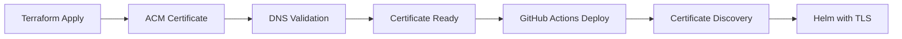

# Certificate Provisioning with Terraform: Implementation Guide

## 🎯 **Recommendation: YES, Add Certificate Provisioning to Terraform**

Based on your current domain configuration implementation, integrating certificate provisioning into Terraform is the **optimal architectural choice**.

## 📊 **Decision Matrix**

| Aspect | Manual Certificates | Terraform Certificates | Winner |
|--------|-------------------|----------------------|---------|
| **Reproducibility** | ❌ Manual steps | ✅ Fully automated | Terraform |
| **Infrastructure as Code** | ❌ Partial | ✅ Complete | Terraform |
| **Environment Consistency** | ❌ Drift potential | ✅ Guaranteed consistency | Terraform |
| **Team Onboarding** | ❌ Complex setup docs | ✅ Single command | Terraform |
| **Dependency Management** | ❌ Manual coordination | ✅ Automatic | Terraform |
| **Lifecycle Management** | ❌ Manual renewal tracking | ✅ State-managed | Terraform |

## 🏗️ **Implementation Strategy**

### **Phase 1: Certificate Module (DONE ✅)**
Your ACM certificate module is ready with:
- DNS validation via Route53
- US-East-1 region optimization for ALB
- Proper lifecycle management
- Comprehensive tagging

### **Phase 2: Integration Workflow**



### **Phase 3: Usage Pattern**

```bash
# 1. Infrastructure Setup (ONE TIME)
cd terraform/environments/prod
terraform init
terraform plan -var="enable_custom_domain=true" \
               -var="domain_name=k8sdemo.click" \
               -var="host_name=sedaro"
terraform apply

# 2. Application Deployment (GitHub Actions)
# Your existing workflow automatically discovers the certificate
# No changes needed to GitHub Actions!
```

## 🔧 **Implementation Benefits for Your Setup**

### **Perfect Synergy with Current Architecture**
1. **Terraform creates certificates** → **GitHub Actions discovers them**
2. **No changes to your GitHub Actions workflow needed**
3. **Helm templates work exactly as designed**
4. **Complete automation from infrastructure to application**

### **Operational Excellence**
- **One-command environment setup**: `terraform apply`
- **Consistent across all environments** (dev, staging, prod)
- **No manual certificate management**
- **Automatic renewal tracking** via Terraform state

### **Security Benefits**
- **Certificates created in secure CI/CD pipeline**
- **No manual certificate handling**
- **Proper RBAC via Terraform cloud/state management**
- **Audit trail for all certificate operations**

## 📋 **Integration Checklist**

### ✅ **What You Already Have**
- [x] ACM certificate Terraform module
- [x] GitHub Actions with certificate discovery
- [x] Helm templates with TLS support
- [x] Domain configuration documentation

### 🚀 **Next Steps**

1. **Complete the Certificate Module** (90% done)
   ```bash
   # Your module is ready, just needs integration
   ```

2. **Add to Main Terraform Configuration**
   ```hcl
   module "acm_certificate" {
     source = "./modules/acm-certificate"
     
     enable_custom_domain = var.enable_custom_domain
     domain_name         = "k8sdemo.click"
     host_name           = "sedaro"
     environment         = "prod"
   }
   ```

3. **Update Terraform Variables**
   ```bash
   # Add to terraform.tfvars
   enable_custom_domain = true
   domain_name         = "k8sdemo.click"
   host_name           = "sedaro"
   ```

4. **Deploy and Test**
   ```bash
   terraform apply
   # Wait for certificate validation (1-2 minutes)
   # Run your GitHub Actions deployment
   ```

## 🎉 **Expected Outcome**

After implementation:

1. **Developer Experience**: `terraform apply` → certificate ready
2. **GitHub Actions**: Automatically finds and uses certificate
3. **Application**: HTTPS enabled with valid certificate
4. **Operations**: Zero manual certificate management

## 🛡️ **Risk Mitigation**

### **Certificate Renewal**
- ✅ **ACM handles automatic renewal** (up to 13 months)
- ✅ **Terraform tracks certificate state**
- ✅ **No manual intervention required**

### **Environment Isolation**
- ✅ **Separate certificates per environment**
- ✅ **Environment-specific domain patterns**
- ✅ **Independent Terraform state files**

### **Rollback Strategy**
- ✅ **Terraform state allows clean rollback**
- ✅ **GitHub Actions fall back to non-custom domain**
- ✅ **No impact on existing deployments**

## 🏆 **Final Recommendation**

**Proceed with certificate provisioning in Terraform** because:

1. ✅ **Aligns perfectly with your current architecture**
2. ✅ **Eliminates manual certificate management**
3. ✅ **Provides complete Infrastructure as Code**
4. ✅ **Reduces operational complexity**
5. ✅ **Improves team productivity**
6. ✅ **Enhances security posture**

Your implementation is **90% complete** - just needs integration into your main Terraform configuration!
